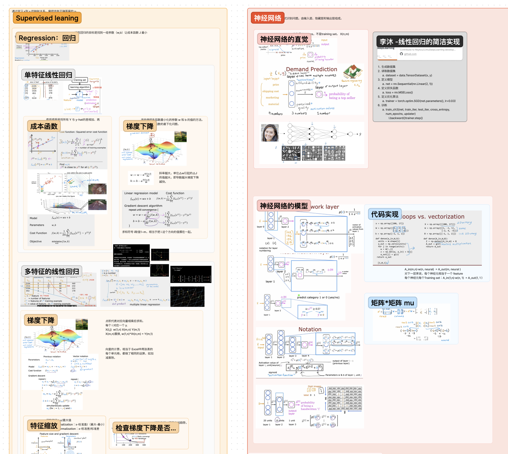

# Deve Into Deep Learning 2023 学习笔记

[李沐动手学深度学习 官网链接](https://zh.d2l.ai)

学习及主要更新目录：d2l_zh/pytorch

学习过程由 ChatGPT 辅助，尽量用中文注释每一行代码。

Up 主对 Python、Pytorch 都不熟，语法会尽量拆解成小步骤执行。

我的运行环境：Apple M1 Max、MacOS 13.3

[我的 Figma 笔记合集：吴恩达机器学习、吴恩达深度学习、李沐动手学深度学习](https://www.figma.com/file/iLgGgkfnFLBetDUZJK1mAO/%E6%9C%BA%E5%99%A8%E5%AD%A6%E4%B9%A0?type=whiteboard&node-id=0%3A1&t=GZQfsQGy3J9oXjQ2-1)

关于 Figam 笔记合计：吴恩达机器学习很简略，只记录了重点内容。吴恩达深度学习是非常全面的。李沐动手学深度学习正在增加中...

